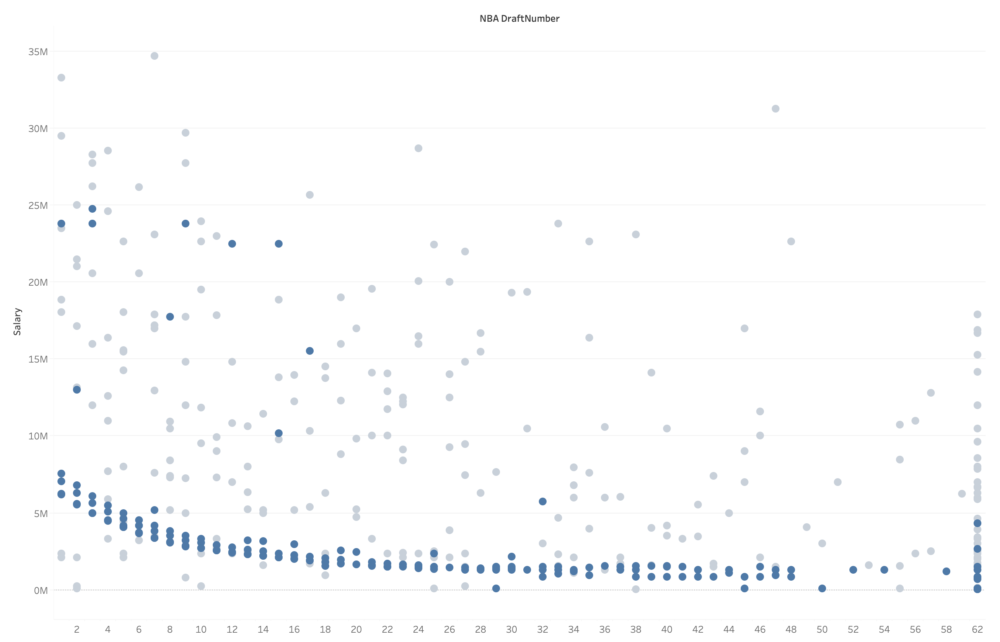
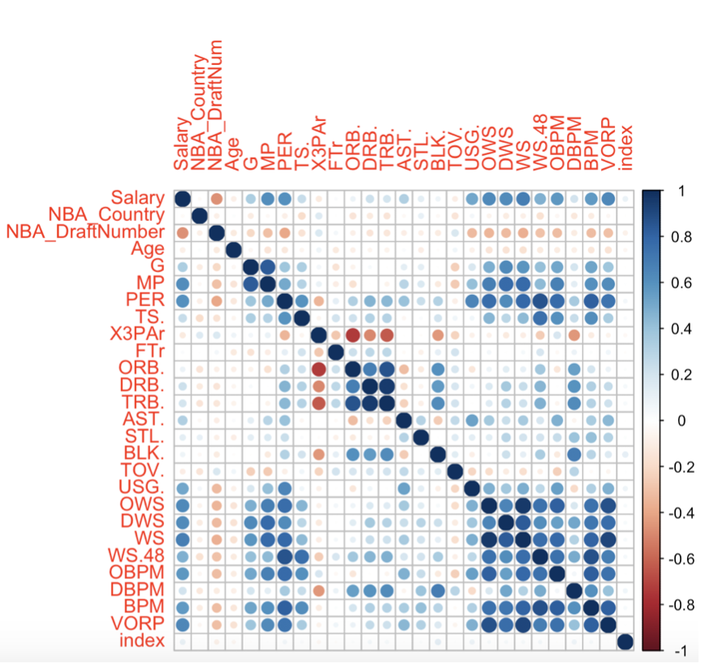
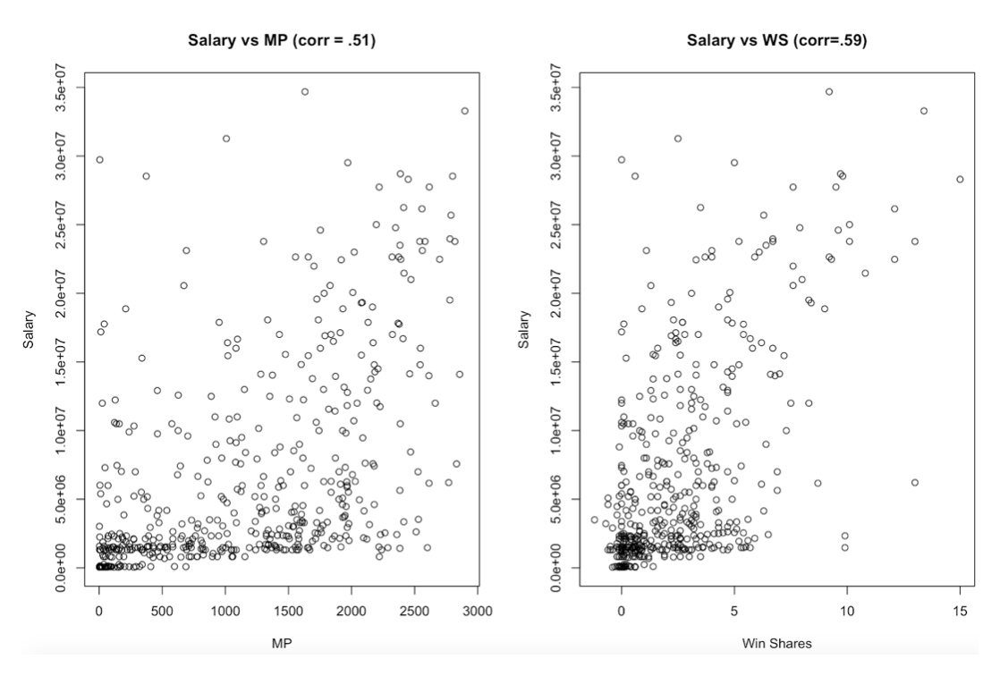
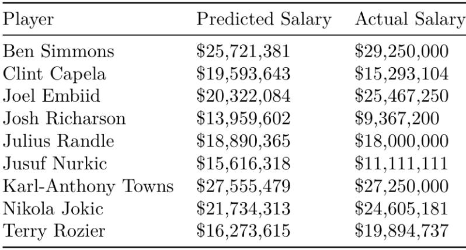

## NBA Salary Analysis

### Overview
The first part of this project was using the 2017-2018 NBA season advanced player statistics to predict salary.  This type of model can be useful for determining free agent value and applied to players on rookie contracts.  The data was taken from [kaggle](https://www.kaggle.com/aishjun/nba-salaries-prediction-in-20172018-season).  A lot of preprocessing had to be done for this dataset including deleting players with very little playing time, injured players, and splitting rookie and veteran contracts.  The veteran dataset was then split into train and test sets.

### Data Visualization
Using Tableau I made a visualization of salary vs draft position.  

  
The blue points are players under 25, the majority of whom are on rookie contracts.  The reason there is a veteran/rookie split is there is a clear trend by draft pick for rookie contracts and it is clear that the only determining factors for their deals are draft position and draft year.  The few players under 25 not on rookie deals were moved to the veteran dataset as well as the few players over 25 who were on rookie deals still.

The correlation matrix below shows which advanced metrics are correlated with each other.  

  

Some of the advanced metrics that are increasingly popular in the NBA analytics community like PER and VORP are highly correlated with salary which makes sense.  One of the more interesting correlations is minutes played with salary.  This indicates players who play more make more.  However, minutes played is not as correlated as the advanced metrics.  This could be due to lesser paid players, including rookies, being important contributors to the team.  This is evident in the bottom right corners of the following plots of minutes played and win shares vs salary.

  

### Models
I tried out 5 different regression techniques on this data to find the best model: OLS, Ridge Regression, LASSO Regression, KNN Regression, and PCR.  For OLS, forward and backward selection was used to determine the model and for the other four models cross-validation was used to determine optimal hyperparameters.

The results are displayed below.  

Choosing the best model involved determining the model that best balanced test error, interpretability, and the handling of multicollinearity across the variables. I first narrowed the model down to Ridge, Lasso, and PCR due to their ability to deal with multicollinearity. I chose Ridge over Lasso because it had a lower test error. Finally, I chose Ridge over PCR because of its much better interpretability.

### Application to Rookies
Running the model on the rookie dataset determined that 174 out of 177 players on their rookie deals were "underpaid".  While 174 appears to be an extremely high number, it is not as striking as it may seem at first. Looking at the difference between the model’s expected salary for a player and actual salary does not take into account the difference between the salary systems for rookies and veterans. Rookie salaries are determined by the salary cap that year. In the 2017/2018 season it was impossible for a player on their rookie contract to have a salary higher than $7,600,000. However, the model predicted 87 out 177 salaries above $7,600,000. This means that the amount of underpaid rookies is caused by an overall undervaluing of rookies in the NBA’s salary system rather than a misvaluing of players by individual teams.  
I used this idea to look at the top 10 "undervalued" players on rookie deals and compare the predicted salary to the deals the players have actually signed (if they have signed one).  Since these new deals were signed in different years, the resulting predictions had to be adjusted depending on the year the deal was signed to account for the yearly increase in salary cap.

The top underpaid players are displayed below.  

