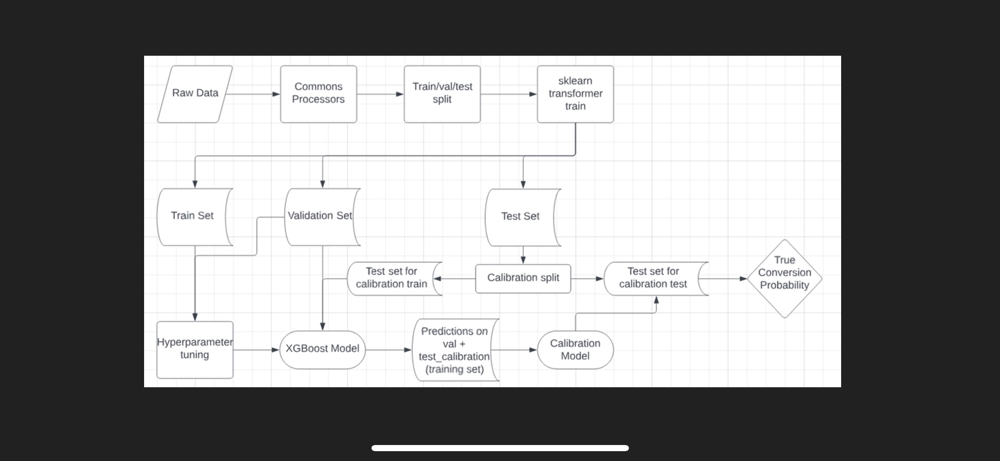

One of the projects I have been focused on is the Dial Prioritization models for unallocated leads.  Specifically, the purchase and refinance retention models.
The architecture I designed for these model is below

Each model had a different distribution of the positive class and it was possible for a banker to get loans from multiple models in their pipeline.  Due to the difference in distributions, the values outputted from different models are not comparable.  In order to address this problem, there was a calibration to get the true probability of a loan closing based on the original distribution of the dataset.  This allows us to compare loans across models and accurately organize a banker's pipeline.

Another key area of this project was the production ready preprocessing.  The processors were designed and tested to be able to handle hourly batch scoring.
