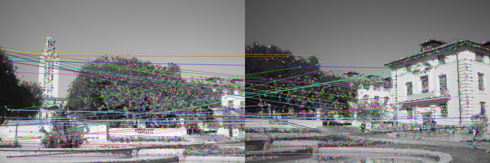
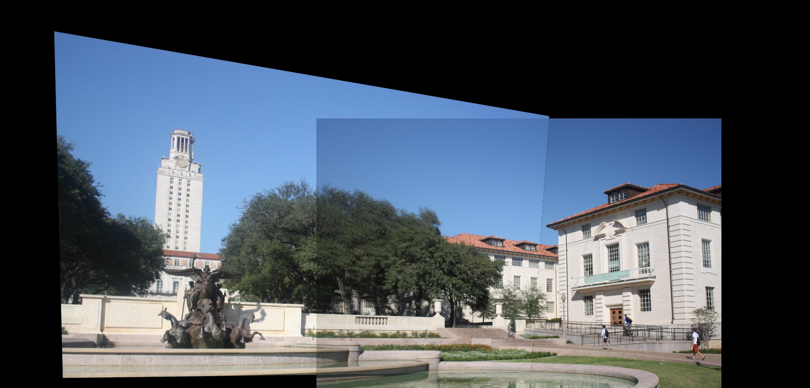
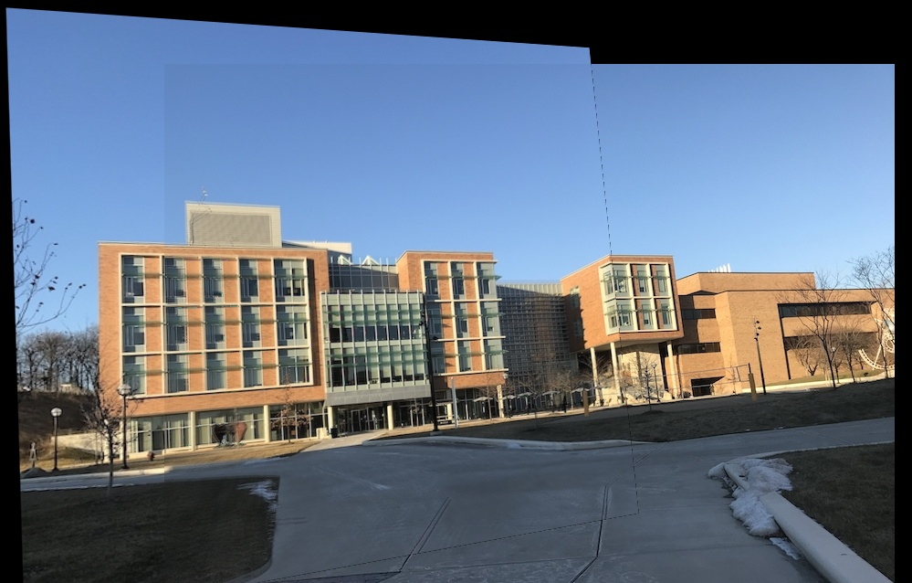

## Image Stitching

The objective of this project was to use image stitching techniques to create panaromic images from multiple input images of the overlapping fields of view.
This was done in part by creating my own functions in addition to using the OpenCV library for certain parts.

## Part 1: Fitting Homography Transformations
The first part involved fitting homography transformations for 2D points.  This was done by converting the 2D points into
homogeneous coordinates and finding the 3x3 matrix representing the transformation.

The red points are the original coordinates, the blue are the homography matrix fitted coordinates, and the green 
(which are very hard to see) are the original transformed coordinates.  
A few examples are shown below:  

  
  
  

## Part 2: The Stitching
Image stitching or photo stitching combines multiple photographic images that have overlapping fields of
view to produce a segmented panorama or high-resolution image.  There are a few steps to get to the end result and I will go through them in light detail below, showing output when helpful.

### 1: Detect Feature Points in the Images
This is done by using SIFT descriptors, which are 128 element long vectors for each point in the image containing information about the gradients at surrounding pixels.  
  

### 2: Find K-Nearest Neighbors of Key Points
I computed a matrix of the distances between the two images using a fast, vectorized numpy approach shown below. Then, I found the 2 nearest neighbors of each key point in the left image.  The keypoints were only considered a putative match if the first neighbor passed the ratio test of first neighbor to second neighbor.  This ratio test is used to weed out points that we are unsure if they match the first neighbor best.  For example, a key point on a plain building will have many nearest neighbors that are close together.  
```
def euclidean_dist(X, Y):
    """
    Inputs:
    - X: A numpy array of shape (N, F)
    - Y: A numpy array of shape (M, F)

    Returns:
    A numpy array D of shape (N, M) where D[i, j] is the Euclidean distance
    between X[i] and Y[i].
    """
    nrm = np.linalg.norm(X, axis=1, keepdims=True)
    D = nrm**2 + np.linalg.norm(Y, axis=1, keepdims=True).T**2 - 2* np.dot(X, Y.T)
    D = np.sqrt(np.clip(D,0,None))
    return D
```

### 3: Use RANSAC to estimate Homography Mapping
I implemented the RANSAC algorithm, which is essentially a robust approach to least sqaures where the input data is expected to have many outliers.  This outlier problem is common in computer vision.  The matches from RANSAC are lines in the following picture.  

  

### 4: The Fun Part: Combining the Images
Finally we get to the point where we can combine the images by warping one using the homography matrix found from RANSAC.  The overlapping pixels are averaged between the two and the finale is displayed below.  



Below is another stitched image of a building on the University of Michigan's campus.  


