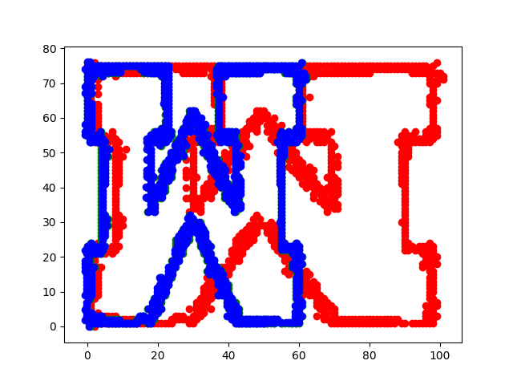
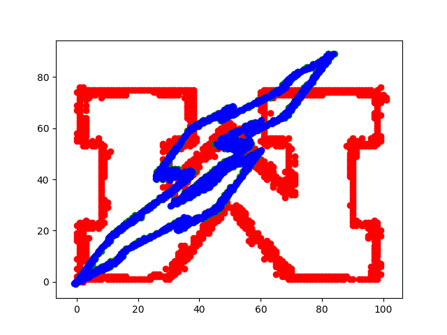
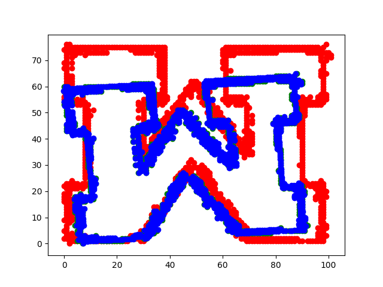
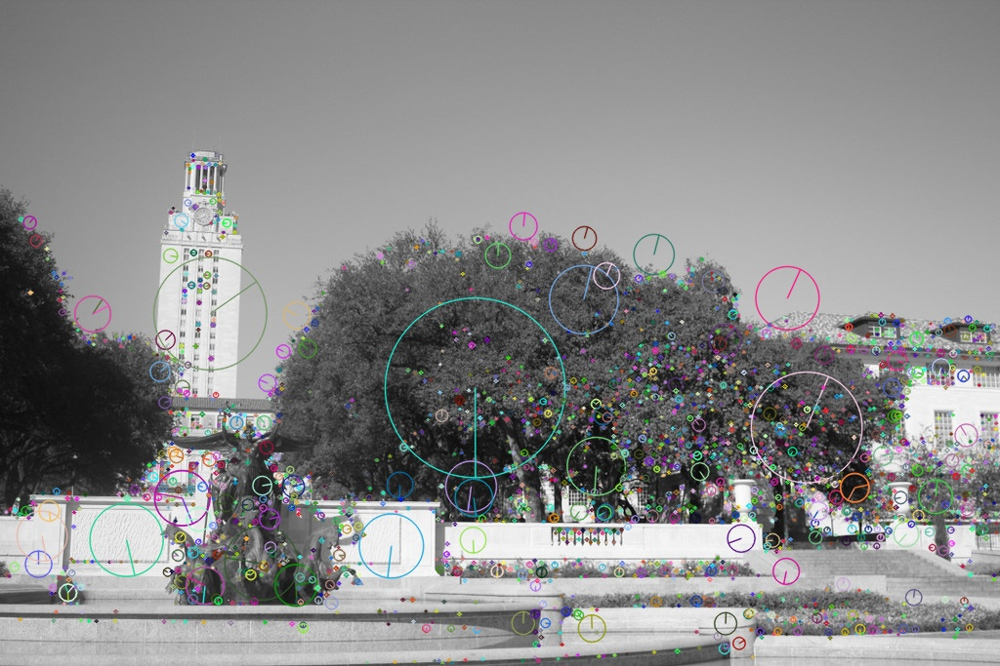
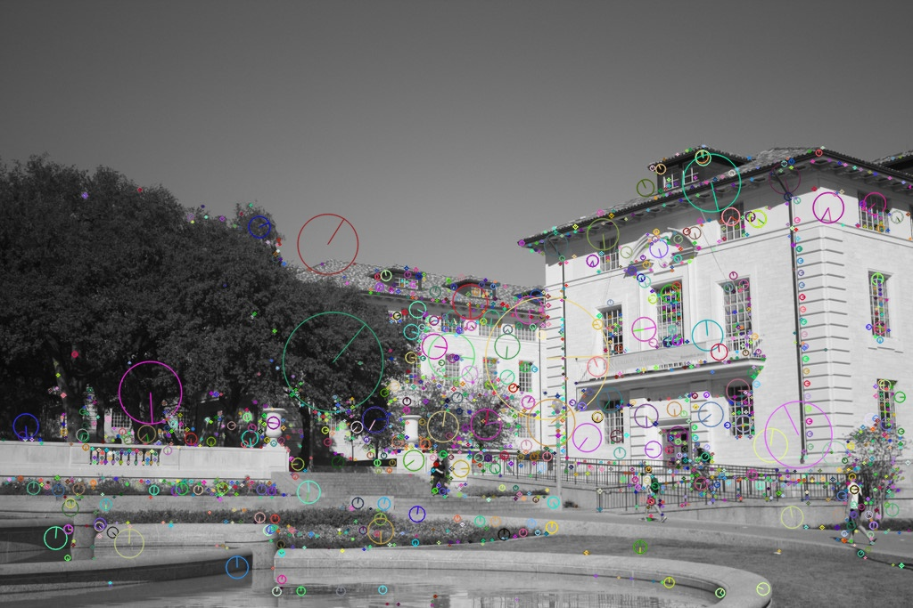

## Image Stitching

The objective of this project was to use image stitching techniques to create panaromic images from multiple input images of the overlapping fields of view.
This was done in part by creating my own functions in addition to using the OpenCV library for certain parts.

## Part 1: Fitting Homography Transformations
The first part involved fitting homography transformations for 2D points.  This was done by converting the 2D points into
homogeneous coordinates and finding the 3x3 matrix representing the transformation.

The red points are the original coordinates, the blue are the homography matrix fitted coordinates, and the green 
(which are very hard to see) are the original transformed coordinates.  
A few examples are shown below:  

  
  
  

## Part 2: The Stitching
Image stitching or photo stitching combines multiple photographic images that have overlapping fields of
view to produce a segmented panorama or high-resolution image.  There are a few steps to get to the end result and I will go through them in light detail below, showing output when helpful.

### 1: Detect Feature Points in the Images
This is done by using SIFT descriptors, which are 128 element long vectors for each point in the image containing information about the gradients at surrounding pixels.  
  

