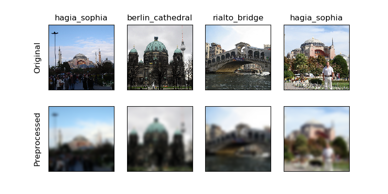
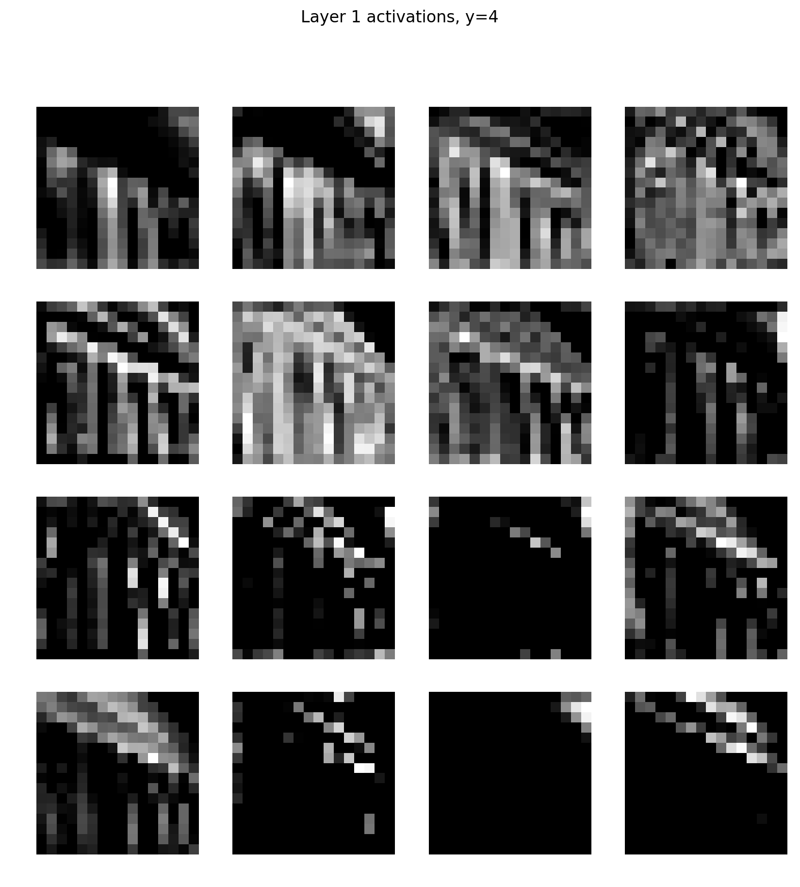
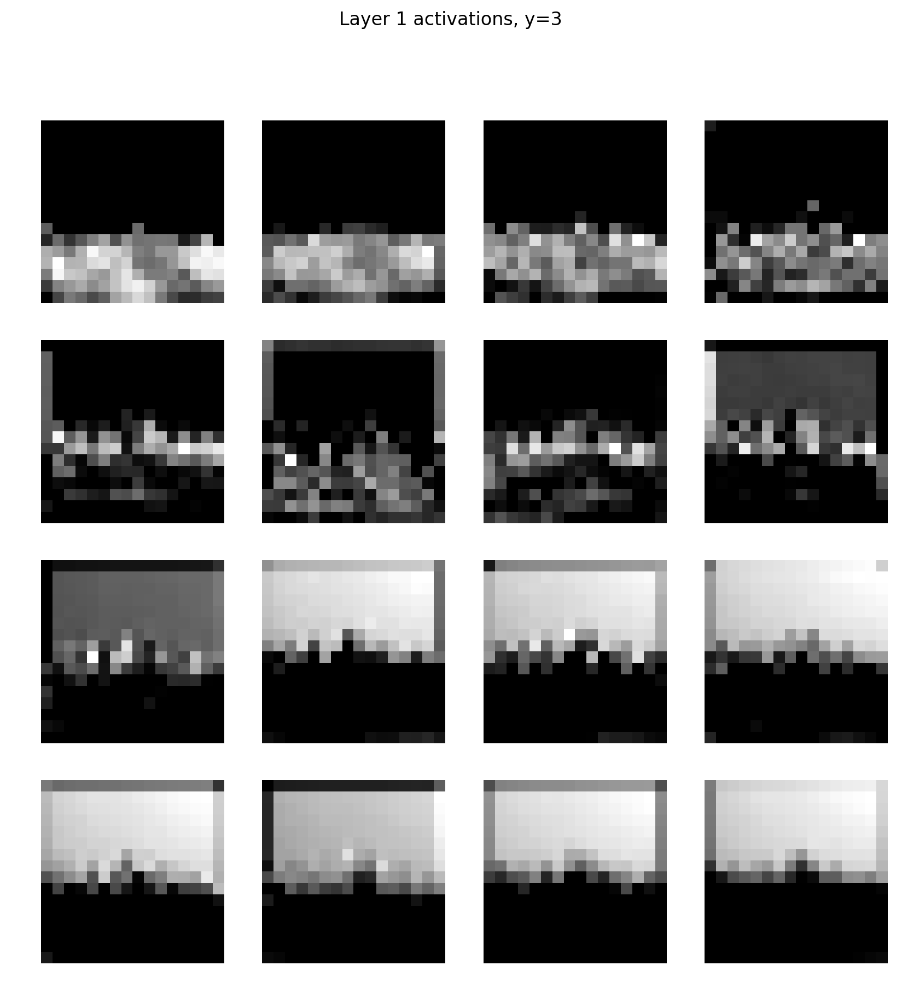
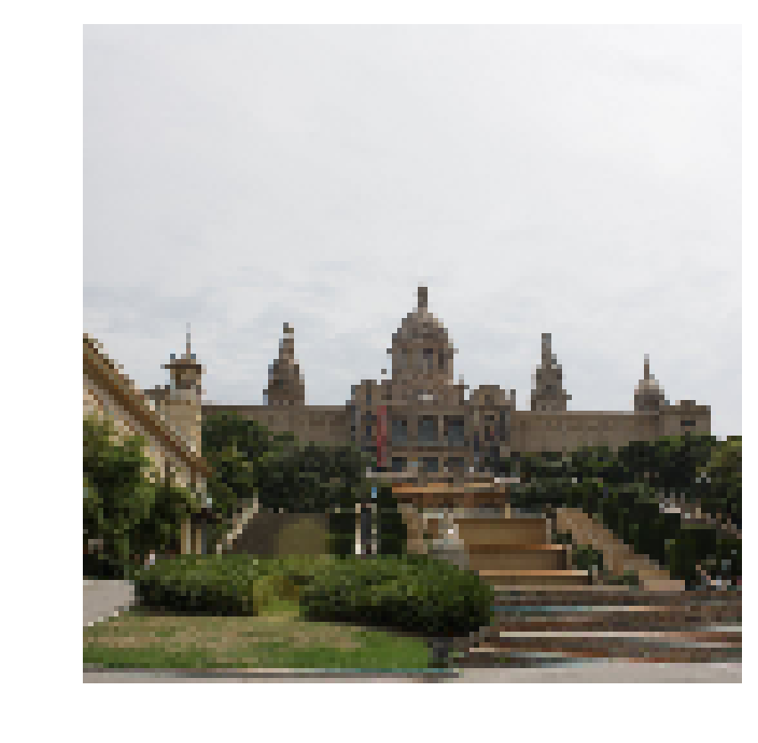
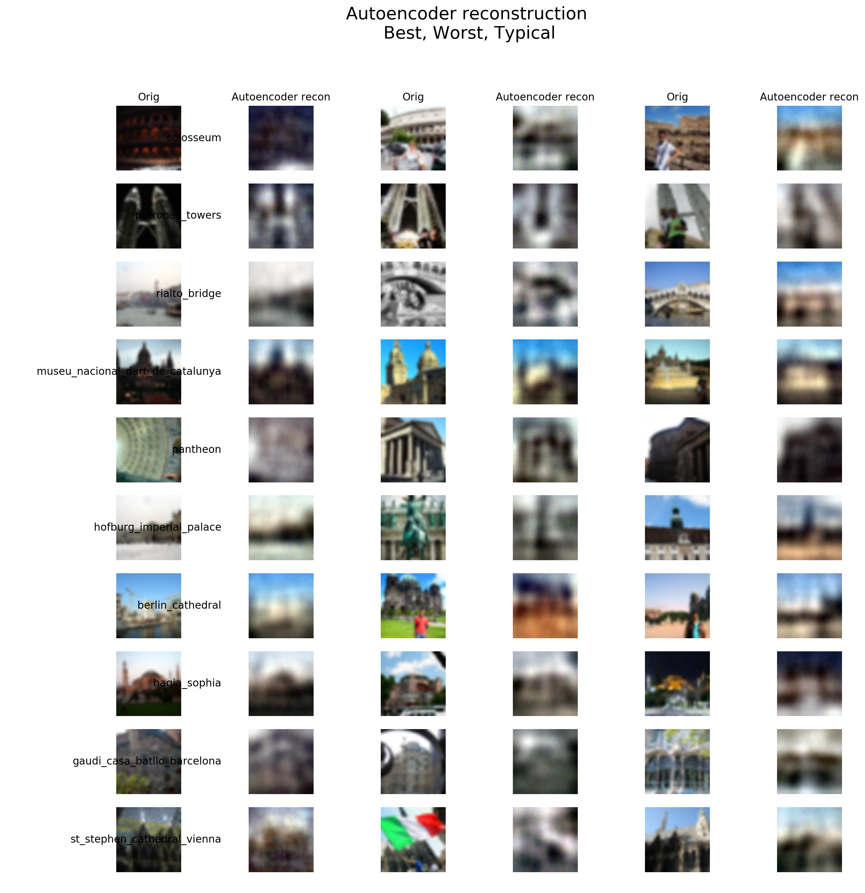

## Welcome to EECS 445 Machine Learning Image Classification Project

I explored both supervised and unsupervised learning techniques for image data.\
Data: 12,500 images of 10 different monuments: Colosseum, Petronas Towers, Rialto Bridge, Museu Nacional d’Art de Catalunya (MNAC), Pantheon,
Hofburg Imperial Palace, Berlin Cathedral, Hagia Sophia, Gaudi’s Casa Batllo, and St. Stephen Cathedral

### Stage 1: Pre-Processing
Here is an example of what the pre-processing did to a couple of images.
 

### Building the Convolutional Neural Network
Here is the architecture for the layers of the network as defined by the spec of the project
```
        conv1 = nn.Conv2d(in_channels=3,out_channels=16,kernel_size=5,stride=2,padding=2)
        conv2 = nn.Conv2d(in_channels=16,out_channels=64,kernel_size=5,stride=2,padding=2)
        conv3 = nn.Conv2d(in_channels=64,out_channels=32,kernel_size=5,stride=2,padding=2)
        fc1 = nn.Linear(in_features=512,out_features=64)
        fc2 = nn.Linear(in_features=64, out_features=32)
        fc3 = nn.Linear(in_features=32, out_features=5)
```
where nn is the torch.nn from the PyTorch library.  The weights of the convolutional layers were normally distributed around 0 with a sigma of 1/sqrt(5*5*in_channels) and the weights of the fully connected layers were normally distributed around 0 with a sigma of 1/sqrt(in_features).  The bias was set to 0 for all layers. 

We can see what the first-layer activation maps look like for a couple of different monuments to observe what each filter is learning.  You can see some of the features that the activation map picks up.




The preprocessed images the maps are based off are below:



### Building the Autoencoder
The goal of using an autoencoder for this project was to learn the internal structure of the input relative to other data points.  The autoencoder is comprised of an encoder which throws away all irrelevant aspects of the data and keep only what is essential for the decoder to reconstruct the data.  It becomes an unsupervised learning problem in this setting because without the labels it is impossible to directly train the network to learn the true encoder function.

The architecture for the autoencoder defined by the spec is below:
```
class Autoencoder(nn.Module):
    def __init__(self, repr_dim):
        super().__init__()
        self.repr_dim = repr_dim
        self.pool = nn.AvgPool2d(kernel_size=2,stride=2)
        self.fc1 = nn.Linear(in_features=768, out_features=128)
        self.fc2 = nn.Linear(in_features=128, out_features=64)
        self.fc3 = nn.Linear(in_features=64, out_features=20736)
        self.deconv = nn.ConvTranspose2d(repr_dim, 3, 5, stride=2, padding=2)
        self.init_weights()

    def init_weights(self):
        for layer in [self.fc1, self.fc2, self.fc3]:
            nn.init.constant_(layer.bias, 0.1)
        nn.init.constant_(self.deconv.bias, 0.0)
        nn.init.normal_(self.fc1.weight,0.0, .1 / sqrt(768))
        nn.init.normal_(self.fc2.weight,0.0, .1 / sqrt(128))
        nn.init.normal_(self.fc3.weight,0.0, .1 / 8)
        nn.init.normal_(self.deconv.weight,0.0, .01)

    def forward(self, x):
        encoded = self.encoder(x)
        decoded = self.decoder(encoded)
        return encoded, decoded
    
    def encoder(self, x):
        N, C, H, W = x.shape
        m = nn.ELU()
        x = self.pool(x)
        x = x.view(-1, 768)
        x = m(self.fc1(x))
        x = m(self.fc2(x))
        encoded = x
        return encoded
    
    def decoder(self, encoded):
        m = nn.ELU()
        x = m(self.fc3(encoded))
        decoded = self._grow_and_crop(x)
        decoded = _normalize(decoded)
        return decoded
    
    def _grow_and_crop(self, x, input_width=18, crop_size=32, scale=2):
        decoded = x.view(-1, self.repr_dim, input_width, input_width)
        decoded = self.deconv(decoded)
        magnified_length = input_width * scale
        crop_offset = (magnified_length - crop_size) // 2
        L, R = crop_offset, (magnified_length-crop_offset)
        decoded = decoded[:, :, L:R, L:R]
        return decoded
```
Where the encoder function defines the operations for the encoder part of the autoencoder, which maps the input examples to d-dimensional representations.
The decoder function defines the operations for the decoder part of the autoencoder, which maps the d-dimensional representations from the encoder back to the original images.  The forward function defines the forward propagation. It simply composes the encoder and decoder functions.

The model was trained with ADAM optimizer and MSE loss function for 20 epochs.\

One of the cool parts of the autoencoder is the ability to reconstruct images.  The best, worst, and average reconstruction based on MSE for each class of monument is displayed below.



### Autoencoder Classifier
This part of the project uses transfer learning to train a landmark classifier using the encoder by freezing the weights of the autoencoder, connecting the output of the encoder to more fully-connected layers, and then training the last layers on the classification task.

The architecture is as follows:
```
class AutoencoderClassifier(nn.Module):
    # skip connections
    def __init__(self, repr_dim, d_out, n_neurons=32):
        super().__init__()
        self.repr_dim = repr_dim

        self.pool = nn.AvgPool2d(kernel_size=2,stride=2)
        self.fc1 = nn.Linear(in_features=768, out_features=128)
        self.fc2 = nn.Linear(in_features=128, out_features=64)
        self.fc_1 = nn.Linear(repr_dim, n_neurons)
        self.fc_2 = nn.Linear(n_neurons, n_neurons)
        self.fc_3 = nn.Linear(n_neurons, n_neurons)
        self.fc_last = nn.Linear(n_neurons, d_out)
    
    def forward(self, x):
        encoded = self.encoder(x)
        z1 = F.elu(self.fc_1(encoded))
        z2 = F.elu(self.fc_2(z1))
        z3 = F.elu(self.fc_3(z2))
        z = F.elu(self.fc_last(z1 + z3))
        return z

    def encoder(self, x):
        N, C, H, W = x.shape
        m = nn.ELU()
        x = self.pool(x)
        x = x.view(-1, 768)
        x = m(self.fc1(x))
        x = m(self.fc2(x))
        encoded = x
        return encoded
```

This is a much quicker method than the CNN classifier and the performance is hardly lost.

||CNN Accuracy |AE Classifier Accuracy|
|---|---|---|
|Colosseum |.5860 |.5234|
|Petronas Towers| .5703 |.5313|
|Rialto Bridge| .5547 |.5391|
|MNAC |.5781 |.5391|
|Pantheon |.5781 |.5860|


While the accuracies are not tremendously high, I learned a lot through my first CNN and Autoencoder project.  More experimenting was done with hyperparameters and different architecture to varying success as a challenge part of the project.
