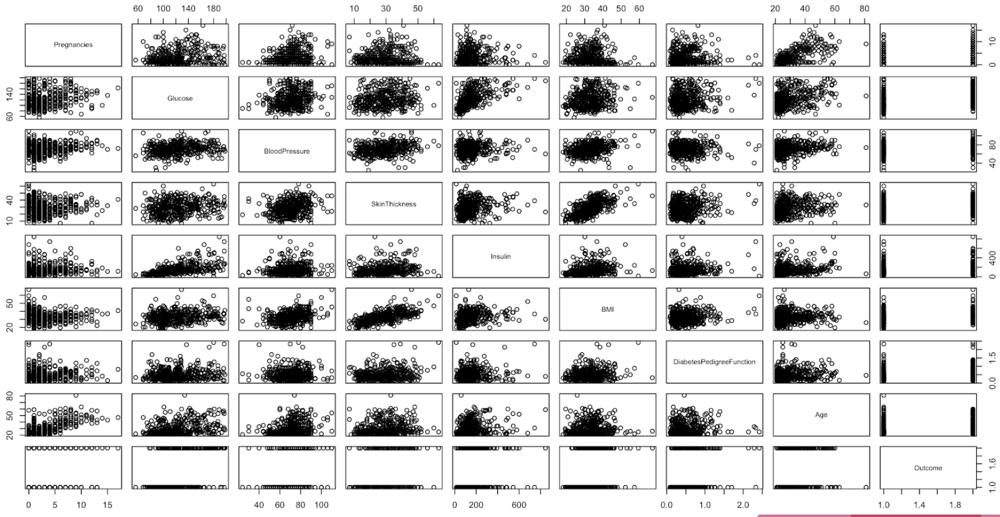

# Diabetes Prediction Using Bayesian Logistic Regression

## 🏥 Project Overview

A **medical diagnostic tool** leveraging Bayesian statistical methods to predict diabetes onset, designed for efficient healthcare resource allocation in rural settings where preliminary screening is crucial.

**Application**: Initial diabetes screening for healthcare resource optimization  
**Methodology**: Comparative analysis of Traditional vs. Bayesian Logistic Regression  
**Technologies**: R, STAN, Bayesian Statistics, Medical Data Analysis

---

## 📊 Dataset & Analysis

### Data Source
- **Origin**: [Pima Indians Diabetes Database](https://www.kaggle.com/uciml/pima-indians-diabetes-database) (Kaggle)
- **Scope**: 392 observations of Pima Indian descent females (age 21+) after data cleaning
- **Innovation**: First known application of Bayesian Logistic Regression to this dataset

### Data Quality Management
- **Missing Values**: Comprehensive handling of incomplete records
- **Target Population**: Focused analysis on Pima Indian heritage females
- **Sample Size**: Optimized dataset of 392 cleaned observations

### Exploratory Data Analysis

*The correlation matrix reveals key relationships between physiological variables and diabetes indicators, informing feature selection for modeling.*

---

## 🧮 Modeling Approach

### Feature Selection
**Backward Selection Process** identified optimal predictors:
- Age
- Blood Pressure  
- Glucose levels
- Diabetes Pedigree Function
- BMI (Body Mass Index)

### Model Architecture
1. **Traditional Logistic Regression**: Baseline performance establishment
2. **Bayesian Logistic Regression**: STAN implementation with R (rstan package)
3. **Prior Information**: Traditional model coefficients used as Bayesian priors

### Technical Implementation
- **Programming**: R statistical environment with STAN for Bayesian computation
- **Package**: rstan for Markov Chain Monte Carlo sampling
- **Validation**: Rigorous train/test split methodology

---

## 📈 Results & Performance

### Model Comparison
| Model Type | Accuracy | Key Advantages |
|------------|----------|----------------|
| **Traditional Logistic** | **85%** | Simpler implementation, higher accuracy |
| **Bayesian Logistic** | 70% | Prior incorporation, uncertainty quantification |

### Clinical Impact
- **Healthcare Application**: Effective preliminary screening tool for resource-limited settings
- **Population Specificity**: Tailored for Pima Indian demographic characteristics
- **Resource Optimization**: Enables efficient allocation of diagnostic resources in rural healthcare

### Limitations & Considerations
- **Demographic Scope**: Limited to females aged 21+ of Pima Indian heritage
- **Data Constraints**: Performance influenced by inherent dataset correlations
- **Model Selection**: Traditional approach demonstrated superior predictive accuracy for this application

---

## 🎯 Healthcare Implications

This project demonstrates the **practical application of advanced statistical methods in medical diagnostics**, particularly valuable for:

- **Rural Healthcare Settings**: Where efficient preliminary screening is essential
- **Resource Allocation**: Optimizing diagnostic testing based on risk stratification  
- **Population Health**: Targeted interventions for high-risk demographic groups
- **Statistical Innovation**: Advancing Bayesian methods in medical applications

*The comparative analysis provides valuable insights into when traditional statistical methods may outperform more complex Bayesian approaches, emphasizing the importance of method selection based on specific application requirements and data characteristics.*
