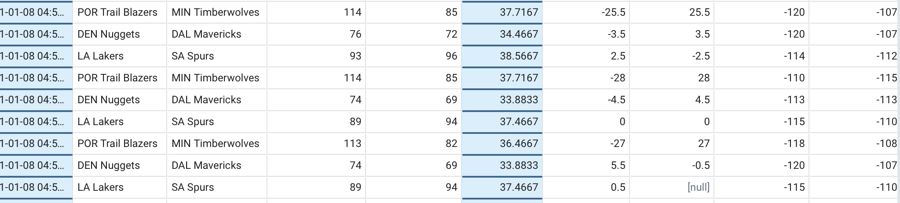

# Live Betting Data Collection System

## 📊 Project Overview

A comprehensive **real-time sports betting analytics platform** built to capture, process, and analyze live betting data across multiple sports. This project demonstrates full-stack data engineering capabilities, combining web scraping, cloud infrastructure, and database management.

**Duration**: August 2020 - January 2022  
**Technologies**: Python, Selenium, PostgreSQL, AWS (EC2, RDS, CloudWatch), Bash Scripting

---

## 🏗️ Architecture & Technical Implementation

### Data Collection Pipeline
- **Real-time Scraping**: Selenium WebDriver deployed on AWS EC2 for dynamic content extraction
- **Database Storage**: PostgreSQL hosted on AWS RDS with optimized schema design
- **Cost Optimization**: Automated EC2/RDS scheduling via AWS CloudWatch to minimize operational costs
- **Monitoring**: Comprehensive logging system for error tracking and performance monitoring

### Infrastructure Design
```
Live Sports Data → Selenium WebDriver (EC2) → Data Processing → PostgreSQL (RDS)
                                    ↓
                           Automated Scheduling & Monitoring
```

### Key Technical Features
- **Automated Deployment**: Complete CI/CD pipeline with bash scripts for server management
- **Fault Tolerance**: Java server health checks and automatic restart capabilities  
- **Data Integration**: Pre-game and post-game data correlation for comprehensive analysis
- **Scalable Architecture**: Designed for easy extension to additional sports and leagues

---

## 📈 Data Sample & Results

### NBA Live Database Structure
The system captures comprehensive in-game metrics including:



**Data Points Collected**:
- Real-time odds movements
- Game state information  
- Betting volume indicators
- Historical performance metrics

---
## 🚀 Future Enhancements & Vision

### Current Capabilities
- **Sports Coverage**: NBA and NFL with extensible framework for additional leagues
- **Scalable Foundation**: Architecture designed for easy integration of new sports and data sources

### Strategic Roadmap  
- **Financial Modeling**: Applying quantitative finance techniques (arbitrage, options strategies) to betting markets
- **Algorithmic Trading**: Developing systematic approaches to live betting opportunities
- **Market Analysis**: Advanced statistical modeling of betting market inefficiencies

### Business Applications
This system serves as a foundation for exploring **data-driven approaches to sports betting**, combining real-time analytics with financial modeling principles to identify market opportunities.

---

*This project showcases end-to-end data engineering capabilities, from infrastructure design to real-time data processing, while demonstrating proficiency in cloud technologies and automated system management.*
